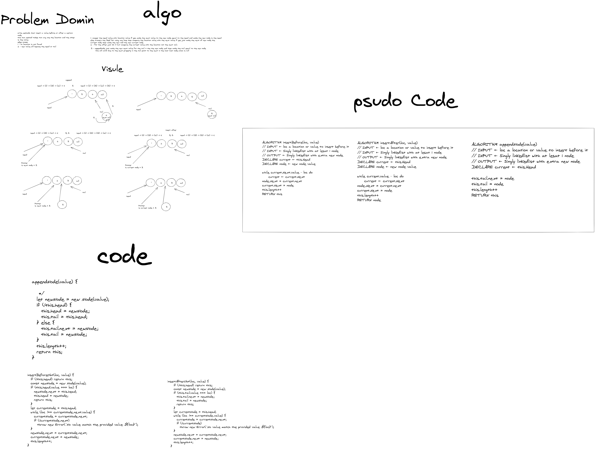

# Singly Linked List

A singly linked list is a type of linked list that is unidirectional, that is, it can be traversed in only one direction from head to the last node (tail).

## Challenge

need to create a singly linked list class that create a linked list and append to head if the list is empty, otherwise append to next node.

- Code Challenge: Class 05: Singly Linked List
  - single liked list class with one method: append
- Code Challenge: Class 06: Extend a Linked List to allow various insertion methods.

  - Extend a linked list class to allow various insertion methods and delete methods.

- implement a kThFromEnd a method that returns the kth to last element of a singly linked list.

- implement linkedListZip that takes two linked lists and returns a new linked list that contains alternating elements from the two lists.

- implement a reverse linked list method that takes a linked list and returns a new linked list that is the reverse of the original linked list.

- implement a isPalindrome method that takes a linked list and returns true if the linked list is a palindrome, false otherwise.

## Approach & Efficiency

using a class to create a linked list.
Big O: O(n)

---

insertion

- append Node
  - time complexity O(1)
  - space complexity O(1)
- insertAfter
  - time complexity O(n)
  - space complexity O(1)
- insertAfter
  - time complexity O(n)
  - space complexity O(1)

---

for the kThFromEnd
Big O time: O(n)
Big O space: O(n)

---

for the linkedListZip
Big O time: O(n)
Big O space: O(3)

---

for the reverse
Big O time: O(n)
Big O space: O(4)

---

for the reverse
Big O time: O(n)
Big O space: O(4)

---

for the isPalindrome
Big O time: O(2n)
Big O space: O(2)

## Whiteboard Process

for the insertion

- append Node
- insertAfter
- insertAfter
  

---

for the kThFromEnd

---

for the linkedListZip

---

for the reverse

---

for the isPalindrome

- [x] Top-level README “Table of Contents” is updated
- [x] README for this challenge is complete
  - [x] Summary, Description, Approach & Efficiency, Solution
  - [x] Picture of whiteboard
  - [x] Link to code
- [x] Feature tasks for this challenge are completed
- [x] Unit tests written and passing
  - [x] “Happy Path” - Expected outcome
  - [x] Expected failure
  - [x] Edge Case (if applicable/obvious)
